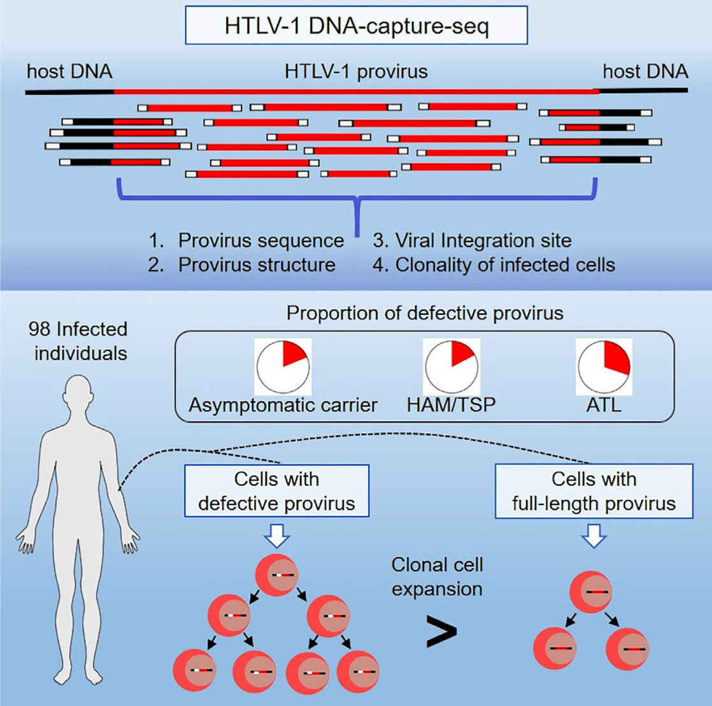

### @katsuya2019 The nature of the HTLV-1 provirus in naturally infected individuals

Samples: 98 HTLV-1 individuals: 28 AC, 29 HAM/TSP(\> TC), and 45 ATLL cases.

Aims: rate of defective proviruses (larger clonal abundance, common at late phases).

Facts:

-   clonal expansion (DNA polymerase), 2 LTR, Tax(pX) transactivate 5'LTR.

-   HAM/TSP related to TC in Japan.

-   Defective proviruses, nonsense mutations, without 6bp

    -   Type 1: missing between 5'LTR and 3'LTR: 2.2%

    -   Type 2: lacking the 5'LTR: 26.7%

-   ED cell line has only one HTLV-1 genome. At least \>10% or 1000 HTLV-1 reads:

    -   500k reads to 1% HTLV-1

    -   50k reads to 10% HTLV-1

-   DNA-probe-seq: NGS paired end, 76x76bp: biotinylated probe and streptavidin bead

